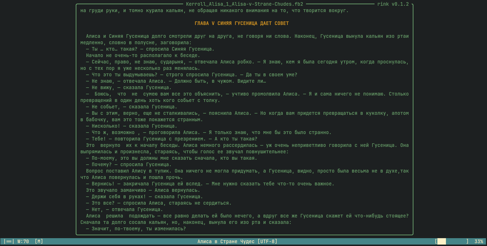
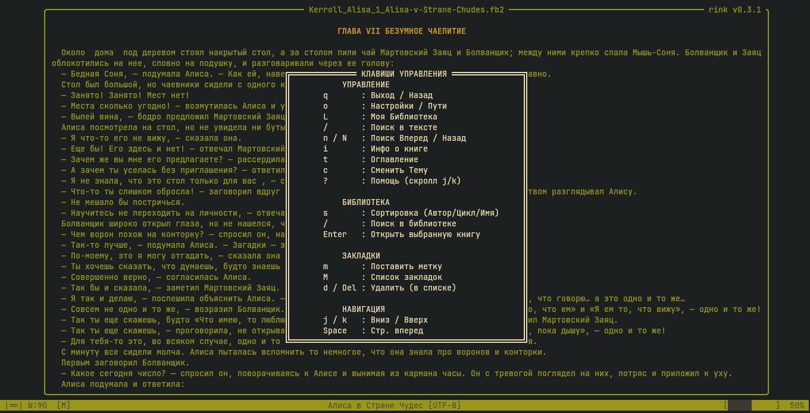
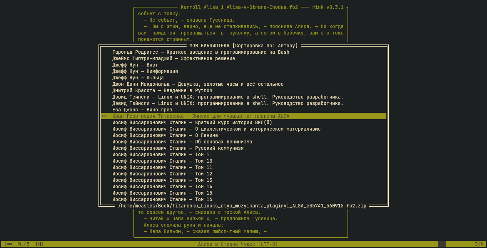
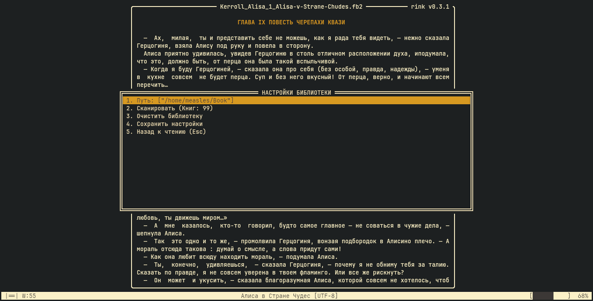

# rink (v0.4.5)

[English](#english) | [Русский](#русский)

---

## English

**rink** is a lightweight, fast, and minimalist TUI (Terminal User Interface) e-book reader for `.fb2` files, written in Rust using the `ratatui` and `crossterm` libraries. Perfect for those who prefer to stay in the terminal and value high performance.

*This is a personal project built for learning Rust. If it compiles and runs—it's already a win.*

### Screenshots
[](screenshots/01.png) [](screenshots/02.png)
[](screenshots/03.png) [](screenshots/04.png)

### Features
* **Localization**: Full support for both **English** and **Russian** languages.
* **Smart Library**: Automatic directory scanning with support for book series and sequence numbering.
* **Smart Sorting**: Switch sorting modes (Author / Series / Title) on the fly with the `s` key while keeping the focus on the current book.
* **Live Search**: Instant book list filtering by any field (author, title, series) directly within the library view.
* **Progress Tracking**: Automatic reading position saving for every single book.
* **Bookmark System**: Quick bookmark tagging (`m`) and an interactive bookmark manager (`Shift+M`) with text preview.
* **Archive Support**: Direct reading from `.zip` archives without manual extraction.
* **Full-Text Search**: Blazing-fast in-book search with syntax highlighting and result navigation.
* **Interactive Footnotes**: Press `f` to view footnotes in an adaptive, centered pop-up window with independent scrolling. All footnotes are also listed at the end of the book.
* **Rich Layout**: Interactive Table of Contents (TOC), multi-encoding support (UTF-8, CP1251), and optimized line rendering (only visible lines are drawn).
* **Customization**: On-the-fly UI color theme switching (`c`) and text block width adjustments (`+` / `-`).
* **Download**: Download and open a book directly from the Internet (NEW)

### Configuration
Library data and layout settings are stored locally in:
`~/.config/rink/library.json`

### Usage
```bash
# Run from the source directory with a specific file
cargo run -- /path/to/book.fb2

# Run compiled binary with a file
rink /path/to/book.fb2

# Run library manager
rink
```

### Installation (Arch Linux)
```bash
git clone https://github.com/1mesles1/rink
cd rink
makepkg -si
```

### Keybindings
* `?` — Open Help menu
* `o` — Open Settings
* `f` — Open interactive Footnote popup
* `s` — Toggle library sorting modes
* `m` — Add bookmark
* `M` (Shift+M) — Open Bookmark manager

---

## Русский

**rink** — легковесный, быстрый и минималистичный TUI-ридер для электронных книг в формате `.fb2`, написанный на Rust с использованием библиотек `ratatui` и `crossterm`. Идеально подходит для тех, кто предпочитает не покидать терминал и ценит высокую скорость работы.

*Это просто проект для изучения Rust. Если запускается — уже хорошо.*

### Особенности
* **Локализация**: Полная поддержка **английского** и **русского** языков интерфейса.
* **Умная библиотека**: Автоматическое сканирование директорий, поддержка циклов (серий) книг и их нумерации.
* **Умная сортировка**: Переключение режимов (Автор / Цикл / Название) кнопкой `s` с сохранением текущего фокуса на книге.
* **Живой поиск**: Быстрая фильтрация списка книг по любому поле (автор, название, серия) прямо в окне выбора.
* **Управление прогрессом**: Автоматическое сохранение позиции чтения для каждой книги.
* **Система закладок**: Быстрое добавление меток (`m`) и удобный менеджер закладок (`Shift+M`) с предпросмотром текста.
* **Поддержка архивов**: Прямое чтение книг из `.zip` файлов без необходимости ручной распаковки.
* **Полнотекстовый поиск**: Мгновенный поиск по книге с подсветкой совпадений и навигацией по результатам.
* **Интерактивные сноски**: Просмотр сносок по клавише `f` во всплывающем адаптивном окне по центру экрана со своим скроллингом. Полный список сносок также доступен в конце книги отдельной главой.
* **Гибкая навигация**: Интерактивное оглавление (TOC), поддержка различных кодировок (UTF-8, CP1251) и оптимизированная отрисовка только видимых строк.
* **Кастомизация**: Смена цветовых схем интерфейса на лету (`c`) и регулировка ширины текстового блока (`+` / `-`).
* **Скачивание**: Скачивание и открытие книги напрямую из сети

### Конфигурация
База данных библиотеки и настройки конфигурации хранятся в:
`~/.config/rink/library.json`

### Запуск
```bash
# Запуск из папки проекта с указанием книги
cargo run -- путь_к_файлу.fb2

# Запуск скомпилированного бинарника с указанием книги
rink путь_к_файлу.fb2

# Запуск библиотеки
rink
```

### Установка (Arch Linux)
```bash
git clone https://github.com/1mesles1/rink
cd rink
makepkg -si
```

### Горячие клавиши
* `?` — Показать меню справки
* `o` — Открыть настройки
* `f` — Открыть всплывающее окно сноски
* `s` — Смена режима сортировки в библиотеке
* `m` — Добавить закладку
* `M` (Shift+M) — Открыть менеджер закладок


